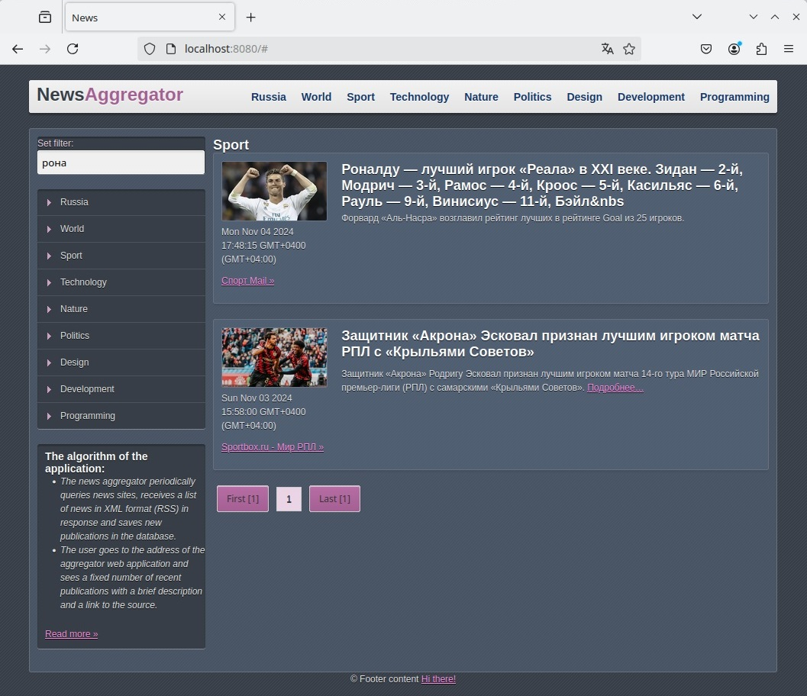

  

# Простой пример реализации микросервисной архитектуры с использованием Kafka, Golang и Docker для новостного агрегатора.




## Описание общего алгоритма работы новостного агрегатора:
  Для реализации задачи используется микросервисный подход.  Программный комплекс содержет четыре сервиса, каждый из которых выполняет свои задачи, содержет свои конфигурационные файлы, независимые базы данных(PostgreSQL). В качестве взаимодействия и обменом данными между сервисами в учебных целях выбран брокер сообщений Apache Kafka.
###  Структура проекта:
1.  Сервис API Gateway с REST API <***api-gateway***>. Используется для приёма трафика от пользователей приложения или веб-сайта. Этот сервис принимает запросы и направляет их сервисам, которые будут их обрабатывать.

2.  Сервис новостей <***service-news***>.  Данный сервис будет выполнять две основные функции: загрузка обновлений из RSS-канала(сохранение информации в БД), отдача новостей по запросу(из имеющейся БД). Сервис имеет свою БД.
    
3.  Сервис комментариев <***service-comments***>.  Данный сервис сохраняет комментарии к статье в БД, так же по запросу отдает информацию по всем имеющимся комментариям к указанной статье. Сервис имеет свою БД.
    
4.  Сервис цензуры <***service-censor***>. Данный сервис проверяет комментарий на содержание запрещенных слов.
    


###  Структура компонентов системы:
1.  Сервис API Gateway с REST API <***api-gateway***>. <br>
- ***main.go*** - основной файл проекта<br>
- ***Dockerfile*** - файл с инструкциями, необходимыми для создания образа контейнера<br>
- ***configKafka.json*** - файл с настройками для Apache Kafka<br>

**Пакеты:**<br>
***pkg\api\api.go*** - реализует характерную для REST API схему запросов. <br>
- Получение всех статей с учетом рубрики, фильтра, номера страницы(pagination). Получает api запрос, перенаправляет в сервис  <***service-news***> используя брокер Kafka, получив данные от сервиса отдает инициатору api запроса.<br>
Get: /news/{rubric}/{count}?filter=filter_var&page=page_num&request_id=requestID<br><br>
- Получение детальной информации по статье. Получает api запрос, перенаправляет асинхронные запросы в сервис  <***service-news***> и <***service-comments***> используя брокер Kafka, получив данные от сервисов при успешном ответе от обоих сервисов, отдает инициатору api запроса.<br>
Get: /newsDetailed?id_news=news_id&request_id=requestID<br><br>
- Добавление комментария к статье. Получает api запрос, перенаправляет запрос в сервис  <***service-censor***> при успешном ответе направляет запрос  в сервис <***service-comments***> используя брокер Kafka, получив данные отдает инициатору api запроса.<br>
Post: /comments?id_news=news_id&request_id=requestID<br><br>
Так же добавлена механизм middleware для считывания и добавления request_id, логирования запросов, обработку и логирования ошибок сервера.<br>

***pkg\kafka\kafka.go*** - реализует взаимосвязь и передачу сообщений между сервисами <br>
***pkg\logger\logger.go*** - реализует логирование данных, запись производится в json файл. Используется буферная запись данных в файл.<br>

2.  Сервис новостей <***service-news***>. 
- ***main.go*** - основной файл проекта<br>
- ***Dockerfile*** - файл с инструкциями, необходимыми для создания образа контейнера<br>
- ***configKafka.json*** - файл с настройками для Apache Kafka<br>
- ***configRSS.json*** - файл с настройками для RSS-каналов<br>
- ***init_news.sql*** - файл со схемой БД PostgreSQL<br>
**Пакеты:**<br>
***pkg\api\storage.go*** - поддержка базы данных под управлением СУБД PostgreSQL. <br>
***pkg\kafka\kafka.go*** - реализует взаимосвязь и передачу сообщений между сервисами <br>
***pkg\logger\logger.go*** - реализует логирование данных, запись производится в json файл. Используется буферная запись данных в файл.<br>
***pkg\rss\rss.go*** - предназначен для декодирования XML потока RSS<br>

Сервис регулярно выполняет обход всех переданных в конфигурации RSS-лент, сохраняет полученные данные в БД. Передает данные согласно запросу с учетом поиска по названию новостей. Реализована пагинация.<br>

3.  Сервис комментариев <***service-comments***>.
- ***main.go*** - основной файл проекта<br>
- ***Dockerfile*** - файл с инструкциями, необходимыми для создания образа контейнера<br>
- ***configKafka.json*** - файл с настройками для Apache Kafka<br>
- ***init_comments.sql*** - файл со схемой БД PostgreSQL<br>
**Пакеты:**<br>
***pkg\api\storage.go*** - поддержка базы данных под управлением СУБД PostgreSQL. <br>
***pkg\kafka\kafka.go*** - реализует взаимосвязь и передачу сообщений между сервисами <br>
***pkg\logger\logger.go*** - реализует логирование данных, запись производится в json файл. Используется буферная запись данных в файл.<br>

Сервис сохраняет новые комментарии к статье в БД и передает все имеющиеся комментарии к статье по запросу.<br>

4.  Сервис цензуры <***service-censor***>.
- ***main.go*** - основной файл проекта<br>
- ***Dockerfile*** - файл с инструкциями, необходимыми для создания образа контейнера<br>
- ***configKafka.json*** - файл с настройками для Apache Kafka<br>
- ***configOffensive.json*** - файл с запрещенными словами<br>
**Пакеты:**<br>
***pkg\censor\censor.go*** - проверяет слова на допустимое употребление <br>
***pkg\kafka\kafka.go*** - реализует взаимосвязь и передачу сообщений между сервисами <br>
***pkg\logger\logger.go*** - реализует логирование данных, запись производится в json файл. Используется буферная запись данных в файл.<br>

Сервис предназначен для проверки слов на цензуру.<br>

4. <***Makefile***> набор инструкций для программы make, помогает собирать программный проект.
5. <***docker-compose.yml***> файл Docker Compose, содержит инструкции, необходимые для запуска и настройки сервисов.
 
## Revision
- 1: init app
   

## Usage:
**1.Enter this command to start the program:**

docker compose build <br>
docker compose up -d <br>

**2.Open the web browser and go to:**
```sh
http://127.0.0.1:8080/ or  localhost:8080
```
## Authors:
@PolinaSvet
**!!! It is for test now !!!**